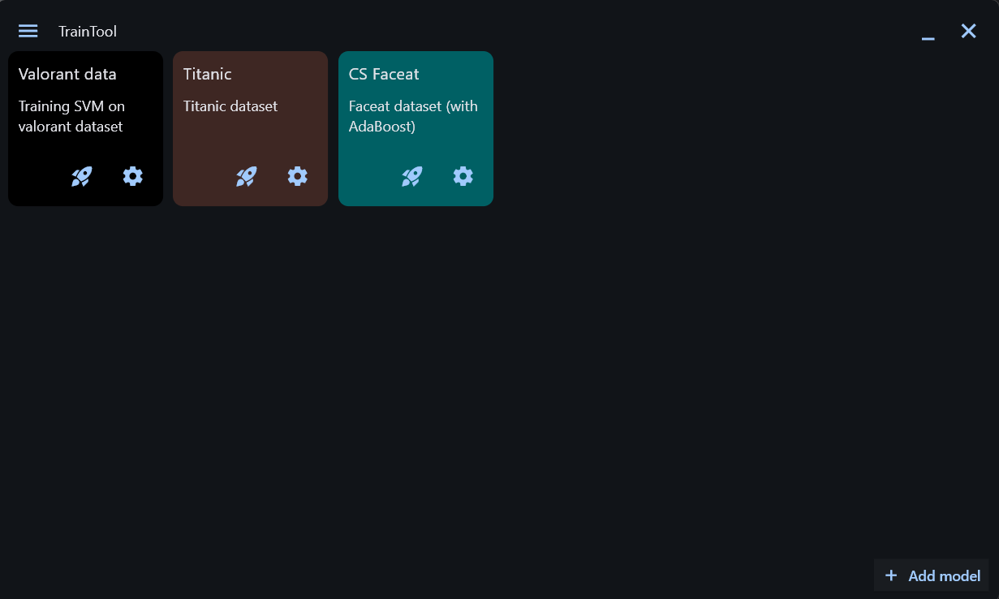
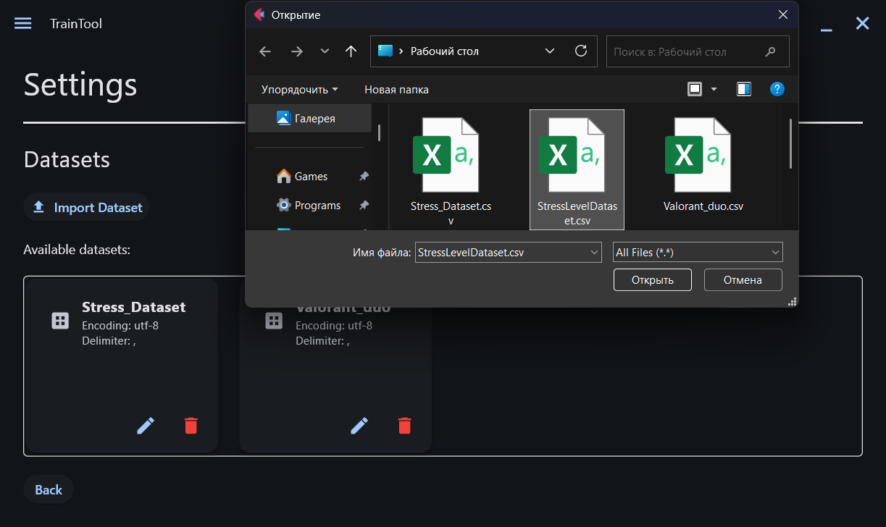
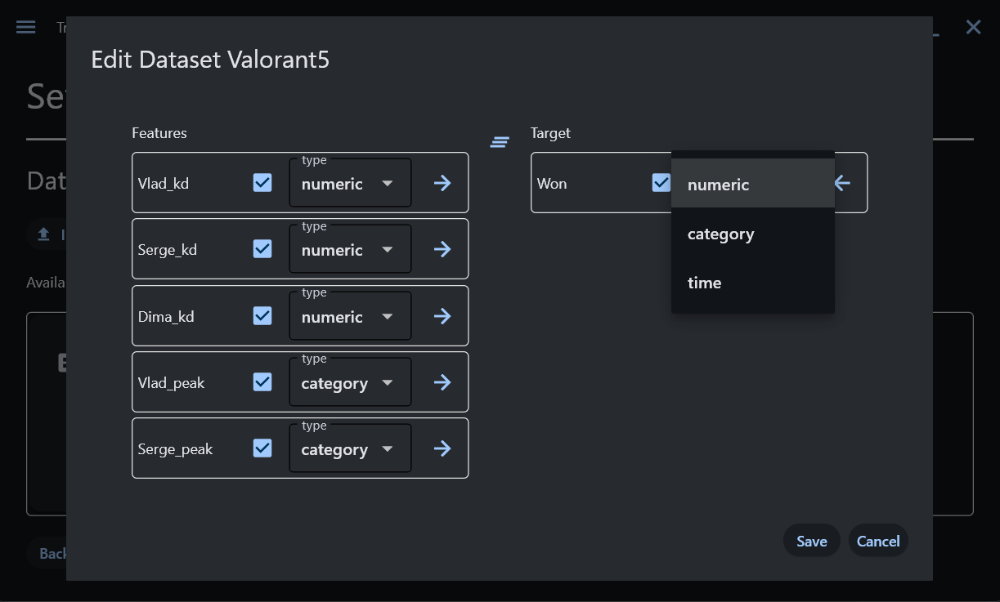
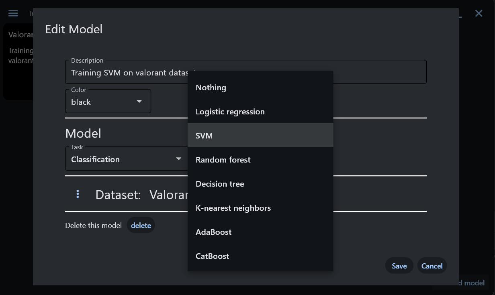
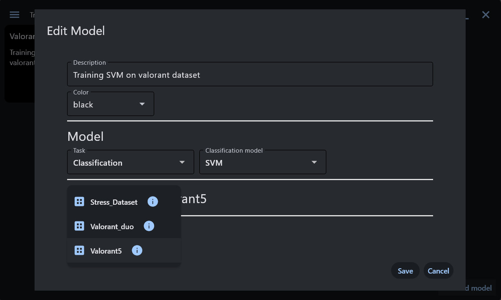
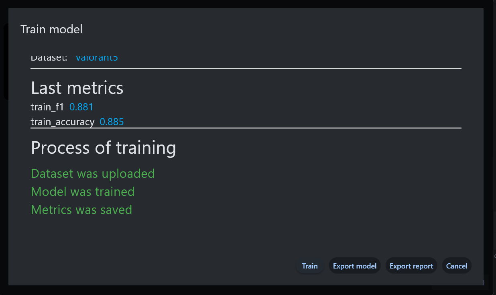
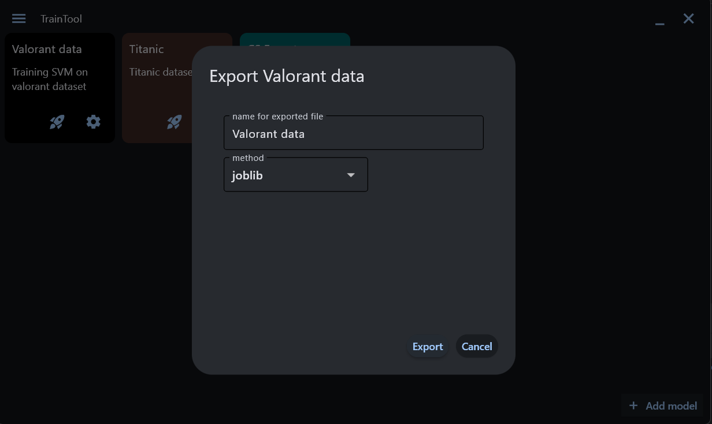
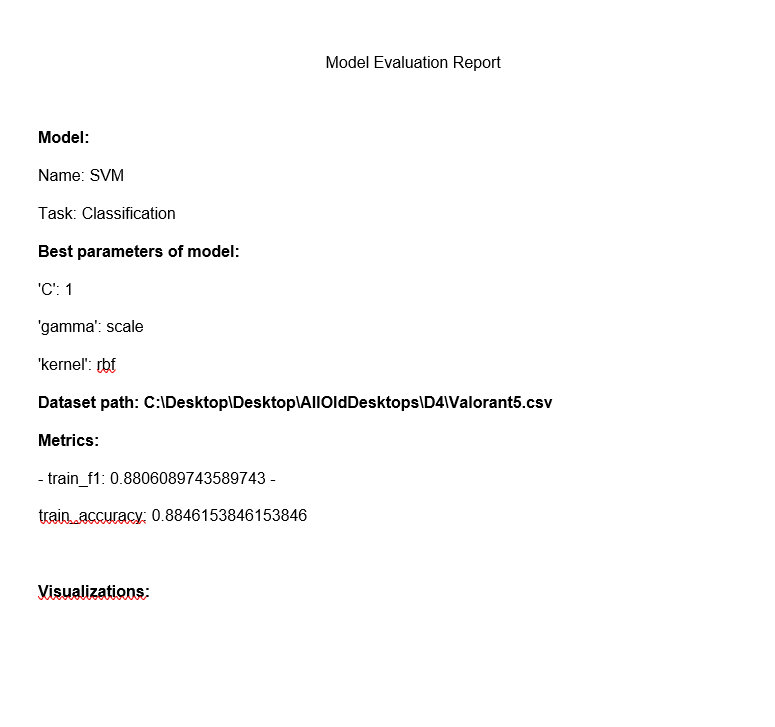
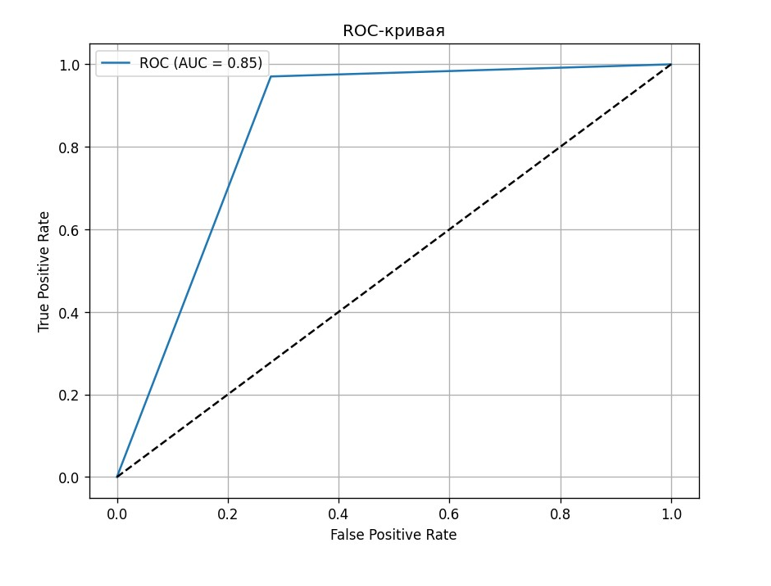
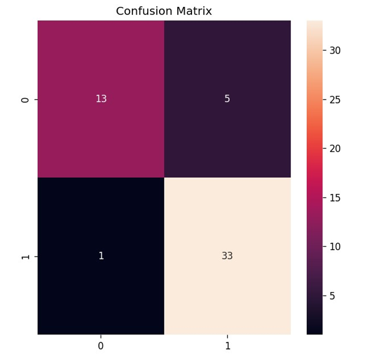

# 🧠 TrainTool (ML Trainer)  

  
Графическое приложение на Python для обучения ML-моделей без написания кода. Загружайте свои датасеты, выбирайте модель, обучайте и экспортируйте результаты — все в несколько кликов.  
    
## ✨ Возможности  
- 📊 Загрузка данных: Поддержка популярных форматов датасетов (CSV/TXT, Excel, JSON).  
- 🤖 Выбор модели: Интеграция нескольких моделей машинного обучения из библиотек scikit-learn, CatBoost.  
- ⚙️ Обучение: автоматический поиск лучших гиперпараметров и выбор лучшей модели. Присутствует функция автоматического преобразования числовых и категориальных колонок, заполнение пропусков в датасете.  
- 📈 Визуализация: Автоматическое построение графиков и метрик (Roc-Auc curve, Confusion Matrix и т.д.) для отчета.  
- 📄 Отчеты: Генерация отчетов об обучении в формате PDF с метриками и визуализацией.  
- 💾 Экспорт: Сохранение обученной модели в форматах pickle или joblib для последующего использования.  
## 🖼️ Скриншоты  
**Процесс выбора датасета, модели и обучение выбранной модели**
| Загрузка датасета | Редактирование датасета | Выбор модели | Выбор датасета | Обучение модели |
| :---: | :---: | :---: | :---: | :---: |
|  |  |  |  |  |  
   
**Экспортирование обученной модели и отчета**  
   
| Экспортирование модели | Пример pdf отчета (1) | Пример pdf отчета (2) | Пример pdf отчета (3) |
| :---: | :---: | :---: | :---: |
|  |  |  |  |  
  
## 🚀 Начало работы  
Предварительные требования  
Перед началом убедитесь, что у вас установлен Python 3.8 или новее.  
  
Установка:  
1. Клонируйте репозиторий:  
```bash
git clone https://github.com/w0drs/TrainTool.git
cd traintool
```  
2. Создайте и активируйте виртуальное окружение (рекомендуется):  
```bash
# Для Linux/macOS
python3 -m venv venv
source venv/bin/activate

# Для Windows
python -m venv venv
.\venv\Scripts\activate
```  
3. Установите зависимости:
```bash
pip install -r requirements.txt
```  
  
**Запуск приложения**
Выполните команду в терминале из корневой директории проекта:  
```bash
python main.py
```
  
Приложение запустится в отдельном окне.  
## 📖 Как пользоваться
1. Запустите приложение
2. Нажмите на три полоски слева-сверху.
3. На вкладке "Settings":
  - Нажмите "Import dataset"
  - В открывшемся окне выбирите датасет, который хотите загрузить (.csv / .txt / .xlsx / .json). Датасет загрузится и появится блок с ним.
  - Если в датасете разделитель не "запятая" или кодирование не "utf-8", то нажмите на блоке с датасетом иконку карандашика (редактирование датасета) и в открывшемся окне редактирования измените соответствущие параметры (иначе датасет не загрузится должным образом)
  - Если датасет загрузился хорошо, то при прокрутке вниз в окне редактирования появятся столбики "features" и "target", где перетаскиванием названий колонок датасета можно установить target значение для датасета, а также колонки с входными значениями (features). Не нужные колонки можно отключить.
  - Справа снизу нажмите на кнопку "Save" для сохранения настроект датасета.  
4. На вкладке "Models":  
  - Нажмите на кнопку "Add model". Откроется окошко с добавлением блока. Тут можно изменить название и описание блока. После этого нажмите "Add".  
  - Когда создастся блок, на нем нажмите на иконку шестерёнки (block settings).  
  - В открывшемся окне редактирования блока в "Models" можно в выпадающем списке выбрать интересующую ML-модель.  
  - Прокрутив ниже до "Dataset:", можно выбрать загруженный датасет, нажав на иконку с тремя точками. Вылезет окошко с загруженными датасетами, где его и можно будет выбрать.  
  - Нажимаем "Save" для сохранения настроек блока.  
  - Когда мы вернулись на вкладку "Models", то на созданном блоке нажимаем иконку ракеты (train model).  
  - В открывшемся окне обучения модели нажимаем кнопку "train" справа снизу. Далее покажется текст прогресса обучения. Если модель обучилась успешно, то выведутся метрики выше текста с прогрессом.
5. После обучения:
  - Нажмите "Export model" для экспортирования модели в формате pickle / joblib  
  - Нажмите "Export report" для создания отчета о модели  
При обучении модели текст прогресса может загорется красным (что означает ошибку обучения).  
  - Если текст красный при загрузке датасета, то, возможно, дело в неправильных настройках датасета (разделитель, кодирование или не выбрана target колонка).
  - Если текст красный при обучении модели, то, возможно, не поставлена галочка в настройках датасета на автоматическом преобразовании датасета.
  - Если текст при обучении модели оранжевый, но окно с обученнием можно закрыть, то произошла непредвиденная ошибка. Может, стоит выбрать другую модель или изменить натройки датасета.

## 🛠️ Технологии  
[Flet](https://flet.dev/) - Фреймворк для построения GUI на Python.  
[Pandas](https://pandas.pydata.org/docs/getting_started/index.html) - Для обработки и анализа данных.  
[Scikit-learn](https://scikit-learn.org/stable/index.html) - Основная библиотека для машинного обучения.  
[Matplotlib](https://matplotlib.org/) - Для визуализации данных и результатов.  
fpdf - Для генерации PDF-отчетов.  

## 📁 Структура проекта
```text
TrainTool/
├── core/
|    ├── datasets/
|    |   ├── dataset.py                  # Хранит в себе путь до датасета и его настройки
|    |   └── datasets_manager.py         # Управляет всеми загруженными датасетами (Создает их, удаляет, возвращает датасет по его id)
|    ├── metrics_visualization/
|    |   └── model_visualizer.py         # Рисует графики для отчета
|    ├── models/
|    |   ├── model.py                    # Сам 'блок' в котором содержится информация о выбранной ML-модели, id выбранного датасета, метриках обученной модели, имени, описании и цвете блока, настройках модели
|    |   └── models_manager.py           # Управляет 'блоками' (Создает их, удаляет, возвращает блок по его id)
|    ├── reports/
|    |   └── report_generator.py         # Создает pdf отчет
|    └── app_state.py                    # Меняет контент главного окна на контент с вкладки "Models" или с вкладки "Settings"
├── ui/
|    ├── components/
|    |   ├── dataset_columns_widget.py   # Виджет, позволяющий перетаскивать названия колонок датасета в столбик "features" или "target"
|    |   └── nav_drawer.py               # Виджет, который появляется при нажатии иконки с тремя полосочками слева сверху. Он дает перейти во вкладки "Models" и "Settings"
|    ├── dialogs/
|    |   ├── add_block_dialog.py         # Окошко для добавления нового "блока" с моделью
|    |   ├── block_edit_dialog.py        # Окошко для редактирования "блока" смоделью
|    |   ├── dataset_edit_dialog.py      # Окошко для редактирования датасета
|    |   ├── dataset_info_dialog.py      # Окошко, в котором содержится краткая информация о датасете
|    |   ├── export_model_dialog.py      # Окно с экспортом модели
|    |   ├── information_windows.py      # Окно для показа окон с информацией (ошибки там, удачные действия...)
|    |   └── train_model_dialog.py       # Окно для обучения модели на выбранном датасете
|    └── views/
|        ├── grid_view.py                # Виджет, в котором содержатся все блоки с моделями
|        ├── main_view.py                # Вкладка "Models"
|        └── settings_view.py            # Вкладка "Settings"
├── images/                              # Папка со скриншотами для README
├── requirements.txt
├── README.md
└── main.py                              # Главный файл приложения
```


